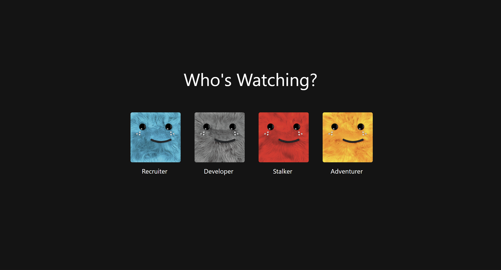

# 🎬 Netflix-Inspired Developer Portfolio


[Live Demo](#-live-demo) · [Features](#-features) · [Tech Stack](#-tech-stack) · [Getting Started](#-getting-started) · [Deployment](#-deployment)

A dynamic, fully-responsive developer portfolio designed to mimic the Netflix UI. This project is built with React and TypeScript, and all content is managed through the DatoCMS headless CMS, allowing for easy updates without touching the code.

<!-- It's highly recommended to replace this with a screenshot of your project! -->



## ✨ Features

- **🎬 Netflix-Inspired UI**: A familiar and engaging user interface.
- **✍️ Fully Dynamic Content**: All text, images, projects, skills, and personal information are fetched from DatoCMS.
- **🎭 Multiple User Profiles**: Tailor the content for different audiences (e.g., 'Recruiter', 'Developer') with unique "Top Picks" sections.
- **📱 Responsive Design**: A seamless experience on desktop, tablet, and mobile devices.
- **🧩 Component-Based Pages**: Separate, dynamic pages for Skills, Projects, Work Experience, and more.
- **✨ Engaging Animations**: Subtle animations to enhance the user experience.

## 🛠️ Tech Stack

- **⚛️ React**: A JavaScript library for building user interfaces.
- **🔷 TypeScript**: A typed superset of JavaScript.
- **🗃️ DatoCMS**: Headless CMS for all content management.
- **🧭 React Router**: For declarative routing in the application.
- **🛰️ GraphQL**: Query language for your API, used via `graphql-request`.
- **🎨 CSS**: Custom styling to achieve the Netflix look and feel.

## 🚀 Getting Started

To get a local copy up and running, follow these simple steps.

### Prerequisites

- Node.js (v16 or later recommended)
- `yarn` or `npm`

### 1. Set up DatoCMS

This project requires a DatoCMS backend to function.

1.  **Create a DatoCMS Account**: If you don't have one, sign up for a free account at datocms.com.
2.  **Create a New Project**: Start a new project from scratch.
3.  **Get Your API Token**: In your project, go to `Settings` > `API Tokens`. Find the **Read-only API token** and copy it. You will need this for your `.env` file.
4.  **Create Models (Schema)**: This is the most important step. Go to `Settings` > `Models` and create the following models with their respective fields. The API identifiers (e.g., `project`, `contact_me`) are important.
    - **Project** (`project`): `title` (String), `description` (String), `image` (Single Asset), `link` (String).
    - **Skill** (`skill`): `name` (String), `level` (Integer).
    - **Certification** (`certification`): `name` (String), `issuer` (String), `date` (Date), `link` (String).
    - **Timeline** (`timeline`): `company` (String), `role` (String), `duration` (String), `description` (Structured Text).
    - **ContactMe** (`contact_me`): `name` (String), `title` (String), `summary` (Structured Text), `profilePicture` (Single Asset), `email` (String), etc.
    - **ProfileBanner** (`profile_banner`): `title` (String), `description` (String), `backgroundImage` (Single Asset).
    - **Image** (`image`): `assets` (Asset Gallery). This is used for the homepage card images.
5.  **Populate Content**: Go to the `Content` tab and add your personal data to the models you just created.
6.  **Image Titles**: For the `Image` model, upload the images you want for the homepage cards. **Crucially, give each image a `Title` in the media library that exactly matches the card's title** (e.g., "Skills", "Projects", "Experience"). This is how the code maps images to cards.

### 2. Install Locally

1.  **Clone the repository**:
    ```sh
    git clone https://github.com/your-username/netflix-portfolio.git
    cd netflix-portfolio
    ```
2.  **Install dependencies**:
    ```sh
    yarn install
    # or
    npm install
    ```
3.  **Create an environment file**: Create a `.env` file in the root of the project (or copy from `.env.example` if present):
    ```
    touch .env
    ```
4.  **Add your API Token**: Add the DatoCMS Read-only API token to your `.env` file.
    ```env
    REACT_APP_DATOCMS_API_TOKEN=YOUR_API_TOKEN_HERE
    ```
5.  **Run the development server**:
    `sh
    yarn start
    # or
    npm start
    `
    The application should now be running on `http://localhost:3000`.

### Useful Scripts

```bash
npm start         # Run dev server
npm run build    # Production build
npm run lint     # Lint TypeScript/TSX
npm run format   # Prettier format
```

## 🎨 Customization

The beauty of this project is that almost all customization happens in DatoCMS, not in the code.

- **✍️ Changing Text**: Edit the entries in your DatoCMS `Content` section for models like `ProfileBanner` or `ContactMe`.
- **🖼️ Changing Images**:
  - For the main banner or profile picture, simply replace the image in the corresponding DatoCMS entry.
  - For the homepage "Top Picks" cards, go to your `Image` model in DatoCMS, and upload/change the images in the `assets` gallery. Remember to set the `Title` of each asset correctly.
- **🎭 Adding/Removing Profiles**: To change the profile types (e.g., add a 'designer' profile), you will need to edit the configuration objects in the following files:
  - `src/profilePage/TopPicksRow.tsx`
  - `src/profilePage/ContinueWatching.tsx`
  - `src/pages/Browse.tsx`

## 🚀 Deployment

This project is ready to be deployed on platforms like Netlify or Vercel.

If hosting on a subpath (e.g., GitHub Pages), set `homepage` in `package.json`.

### Deploying to Vercel

1.  Push your code to a GitHub, GitLab, or Bitbucket repository.
2.  Go to Vercel and sign up using your Git provider.
3.  Click "Add New..." → "Project".
4.  Import your portfolio repository.
5.  Vercel will automatically detect that it's a Create React App and configure the build settings for you.
6.  Before deploying, go to the "Environment Variables" section.
7.  Add your DatoCMS API token:
    - **Key**: `REACT_APP_DATOCMS_API_TOKEN`
    - **Value**: _Your actual DatoCMS API token_
8.  Click "Deploy". Your portfolio will be live in minutes!

### Deploying to Netlify

1.  Push your code to a GitHub, GitLab, or Bitbucket repository.
2.  Go to Netlify and sign up using your Git provider.
3.  Click "Add new site" → "Import an existing project".
4.  Select your portfolio repository.
5.  Netlify will detect it's a Create React App. Confirm the following settings:
    - **Build command**: `npm run build` (or `yarn build`)
    - **Publish directory**: `build`
6.  Click "Show advanced" → "Add environment variables".
7.  Add your DatoCMS API token:
    - **Key**: `REACT_APP_DATOCMS_API_TOKEN`
    - **Value**: _Your actual DatoCMS API token_
8.  Click "Deploy site".

## ⭐ Show Your Support

If you find this project helpful or inspiring, please give it a ⭐ on GitHub! It helps and is much appreciated.

## 🤝 Contributing

Contributions, issues, and feature requests are welcome! Feel free to check the issues page for this repository.

Quick start:

```bash
git checkout -b feat/short-description
# make changes
npm run format && npm run lint
git commit -m "feat: short description"
git push origin HEAD
# open a PR
```

This repo uses Prettier and an optional Husky pre-commit hook to run `lint-staged` for formatting.

## 🔄 Changelog (high-level)

- Cleanup: removed dead code/comments, stabilized React keys, tightened types.
- Tooling: added Prettier + ESLint, optional Husky pre-commit hook, `lint-staged`.
- Docs: improved setup, scripts, and deployment guidance.

## 📜 License

Distributed under the MIT License. See `LICENSE` for more information.

## 📬 Contact

Your Name - @your_twitter - your.email@example.com

Project Link: https://github.com/your-username/netflix-portfolio
